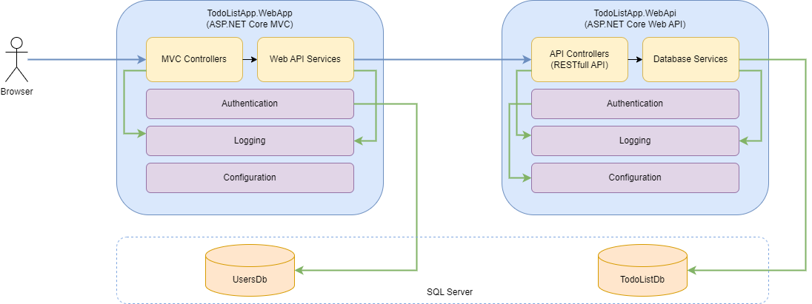

# To-do List Application

## Software Architecture

The solution must have a 3-tier architecture:
  * The presentation tier — the web application named *TodoListApp.WebApp* that provides browser user interface for the end-users allowing them to manage their to-do lists.
  * The logic (application) tier — the web API application named *TodoListApp.WebApi* that provides a RESTful API the web application must use to retrieve or save to-do lists or user's data.
  * The data tier is the relational database management system for storing to-do lists and other user's data.

