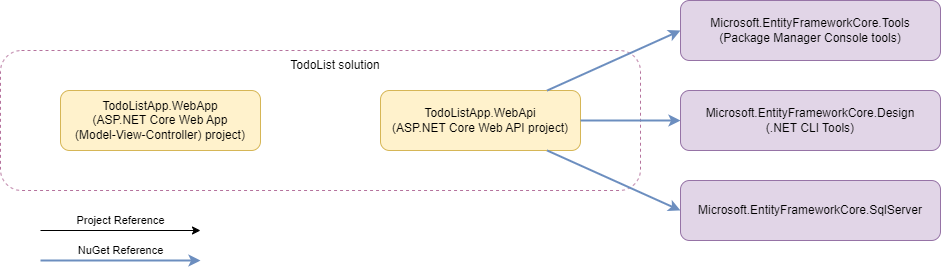
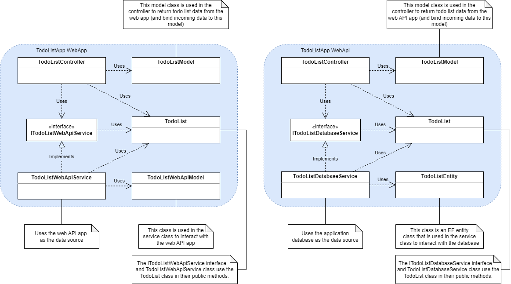
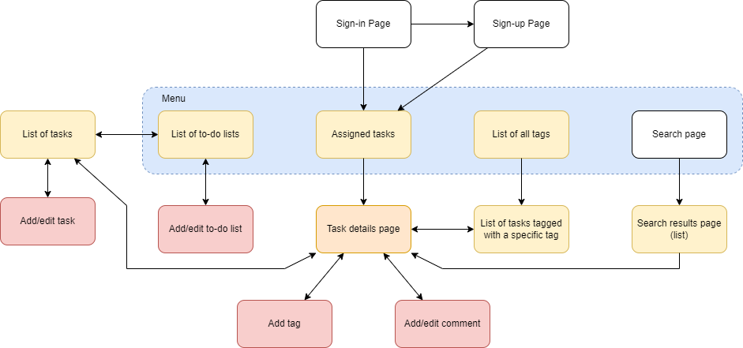

# To-do List Application

## Solution Requirements

This section describes the technical requirements related to the target platform, solution codebase, code quality, etc.

### C# Projects

The solution must contain two ASP.NET Core applications (*TodoListApp.WebApp* and *TodoListApp.WebApi*) and four class libraries. All C# projects used in this solution must be included in the [TodoListApp.sln](TodoListApp.sln) solution file.

| Component                                                                                            | Template Name                                | Description                                                                                        |
|------------------------------------------------------------------------------------------------------|----------------------------------------------|----------------------------------------------------------------------------------------------------|
| [TodoListApp.WebApp](TodoListApp.WebApp/TodoListApp.WebApp.csproj)                                   | ASP.NET Core Web App (Model-View-Controller) | A web application to provide the end-users with the browser UI.                                    |
| [TodoListApp.WebApi](TodoListApp.WebApi/TodoListApp.WebApi.csproj)                                   | ASP.NET Core Web API                         | A web API application that provides a RESTful API to manage the to-do lists and user's data.       |

The diagram belows shows the dependencies of C# projects in the expected solution.

The class diagram below is an example of using C# projects to store data classes (TodoList), service interfaces (ITodoListService), and service classes (TodoListWebApiService, TodoListDatabaseService).

### Site Map

The site map below shows how a user can navigate throw the application's web starting from the *Sign-in Page*.

### Application Requirements

* Add data validation to your controllers to avoid situations when incorrect input is passed to application services and repositories.
* The endpoints of the web API application must follow the RESTful API principles.
* The application must have the right approach implemented for handling application errors:
    * The controller actions must handle exceptions thrown by application services and repositories.
    * The controller action must return a meaningful status code when the expected exception is thrown.  
    * The controller action must return an "Internal Server Error" status code if an unexpected exception is thrown.
    * The controller action must log events (errors, warnings, and trace messages) using the ASP.NET Core logging features.
* The application must read its configuration settings from the JSON settings files using the JSON configuration provider.
* All the endpoints of an web API application that return a list of data entities must be paginated. You have to decide how to implement pagination for your API.
* The data access layer is a set of repositories that provide CRUD operations for managing data entities.
    * A repository is a class that provides CRUD operations for finding and managing the data entities it is responsible for.
    * The repository methods for each repository must be declared in the appropriate interface, which the repository class must implement.
    * Use the Entity Framework Core object-relational mapper to access the database tables; data access should be designed with a *code-first* approach.
    * During application development, use EF migrations to smoothly evolve your database.
* A web application must have a good-looking browser UI; style your web pages by adding custom CSS
* When the application is ready, review the application's performance and eliminate all performance issues.

### Authorization & Authentication

* The web application must support user authentication and authorization to allow an application user to manage the only to-do lists and tasks the user has access to. Use the ASP.NET Core Identity API to allow users to create an account on the website.
* The web API application must support the most simple authentication mechanism, protecting the API from being accessed by an unauthorized user. Consider securing your web API application by using the Bearer Authentication token, where the security key is stored in the config file of the web application.
